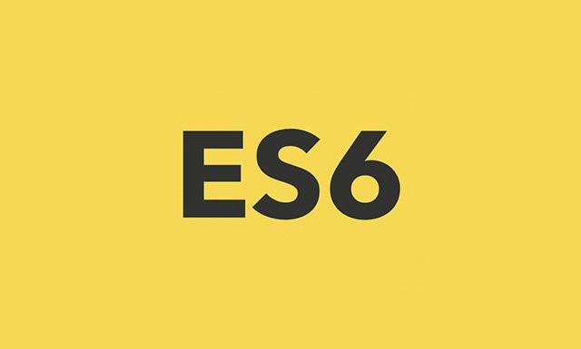

## <strong>Hello, my name is Tevin and I'm a inspiring Web Developer 👨🏾‍💻 </strong>

 

  
  

# About Me 

I first learned to code at the beginning of 2019 but I literally had no luck with it. I struggled to retain things, and I couldn’t get things to stick. I could not have hated coding more than I did at the time. 

Not until August 2021 did I ACTUALLY start learning programming and coding in a way that worked for me. After two years of self learning. I've finally knew how to learn coding by trial and error 

Now, I enjoy learning new technologies and new programming languages by making something from scratch step by step as well as working on real-world projects

# Recent Achievements 

## 🧰 Languages and Tools:

 
 

